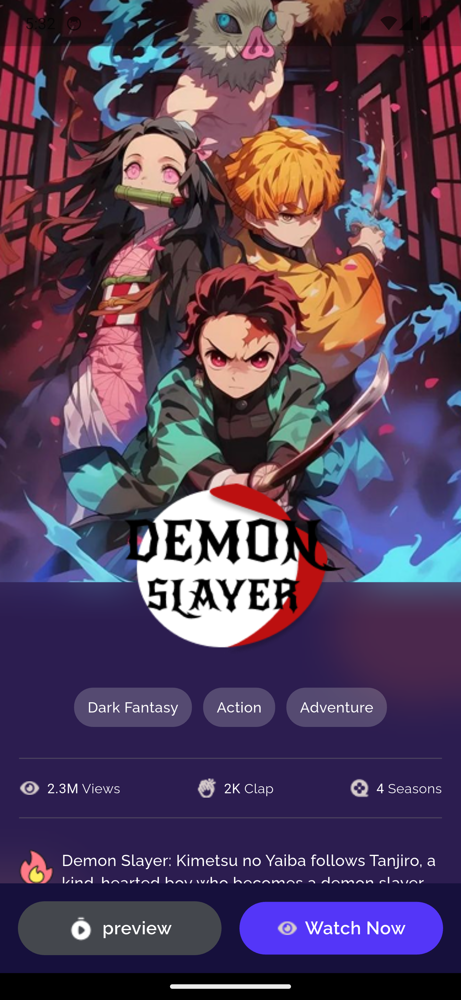

# Anime Discovery Flutter App

A sleek and engaging Flutter application for browsing and discovering new anime. This app showcases a modern UI, smooth animations, and a clean, scalable architecture.

##  Demo


<video src="https://github.com/user-attachments/assets/f29a6964-470d-4e3a-9b4c-d9687c0e89a7.mp4" controls width="600">
  Your browser does not support the video tag.
</video>


|                 Home Screen                  |                 Details Screen                  |             Upgrade Screen              |
| :------------------------------------------: | :---------------------------------------------: | :------------------------------------------: |
|  |  |  |


## ✨ Features

- **Home Screen**: Browse anime posters, filter by category, and see top characters.
- **Detail Screen**: View detailed information about a selected anime, including description, stats, and genre tags.
- **Subscription Plan Screen**: A dedicated screen to showcase subscription options.
- **Smooth Page Transitions**: Custom-built, visually appealing screen transitions for a premium feel.
- **Clean Architecture**: Organized codebase for scalability and maintainability.
- **State Management**: Efficiently manages app state using `flutter_riverpod`.

## 🏛️ Architecture

This project follows the principles of **Clean Architecture** to create a separation of concerns, making the code easier to test, maintain, and scale. The `lib` directory is structured into three main layers:

-   **Presentation**: Contains the UI of the application (Widgets, Views, and Riverpod Providers for UI state).
-   **Domain**: The core of the application. It includes the business logic, entities (data models), and use cases. This layer is independent of any other layer.
-   **Data**: Responsible for providing data to the domain layer. It contains repository implementations and data sources (e.g., remote APIs or local databases).

**State Management**: We use `flutter_riverpod` for dependency injection and state management, which allows for a reactive and decoupled architecture.

## 🚀 Getting Started

### Prerequisites

-   Flutter SDK (version 3.x or higher)
-   An editor like VS Code or Android Studio

### Installation

1.  **Clone the repository:**
    ```bash
    git clone https://github.com/mohamedrashad102/flutter-mentors-r3.git
    cd flutter-mentors-r3
    git checkout week-2/anime_app
    ```

2.  **Install dependencies:**
    ```bash
    flutter pub get
    ```

3.  **Run the app:**
    ```bash
    flutter run
    ```

## 📂 Folder Structure

The `lib` folder is organized as follows to support our Clean Architecture approach:

```
lib
├── core/
│   └── utils/        # Core utilities like colors, images, and transitions
├── features/
│   ├── home/
│   │   ├── data/     # Data sources and repository implementations
│   │   ├── domain/   # Entities, use cases, and repository contracts
│   │   └── presentation/ # UI (views, widgets, providers)
│   ├── detail/
│   └── plan/
├── anime_app.dart    # Root widget of the application
└── main.dart         # Entry point of the application
```
